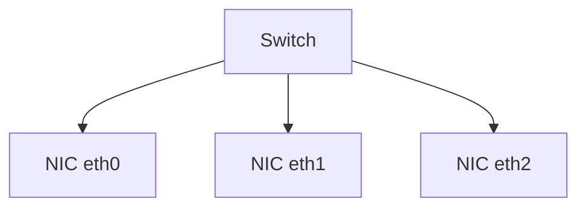
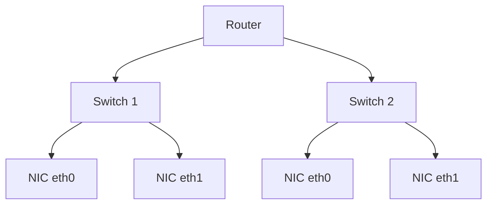
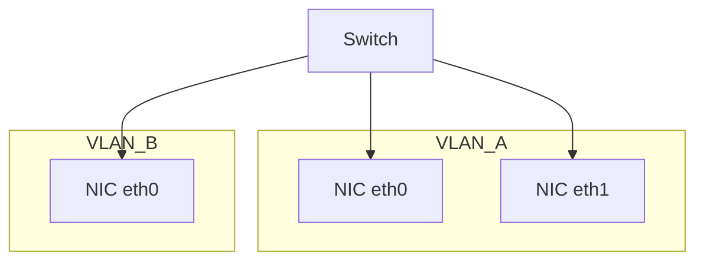

# System Administration - Network

## Table of Contents
- [System Administration - Network](#system-administration---network)
  - [Table of Contents](#table-of-contents)
  - [What is what?](#what-is-what)
  - [Switch](#switch)
  - [Router](#router)
  - [VLAN](#vlan)

## What is what?
- **IP** ? 
  - Each NIC card is defined by it's `IP`. There are two defined IPs; Private and Public.
  - IP is consist of 4 `octet` [`octet.octet.octet.octet`]
  - Private IP: {`10.0.0.0/8`, `192.168.0.0/16`, `172.16.0.0 : 172.32.0.0`}.
- **Mask** ? /8, /16, or /32 
  - It's the ip's mask.
  - The mask define the range of ips.
- How to calculate the IPs range?
  - **Mask** defines the fixed `octet` in the IP. 
  - e.g., `/8` means 8 bits = (255.0.0.0) Decimal = (11111111.00000000.00000000.00000000) Binary.
  - e.g., `/16` means 16 bits = (255.255.0.0) Decimal = (11111111.11111111.00000000.00000000)
  - You can consider that the mask is bitwise add (logically operation) with the IP.
   - **Subnet** is a range of IP addresses: (Network Address + Mask) e.g., (`192.168.1.0/24`)
    - Accordingly, for example:
      - Each IP `10.x.x.x (/8)` means that the Network address for this IP range all have a 1 fixed octet; all start with 10.x.x.x, starting from `10.0.0.0` till `10.255.255.255`.
      - Each IP `192.168.x.x (/16)` means that the Network address for this IP range all have a 1 fixed octet; all start with 10.x.x.x, starting from `192.168.0.0` till `192.168.255.255`.

  ```
  IP: 192.168.1.130
  Mask: 255.255.255.0   (/24)
  
  IP:    11000000.10101000.00000001.10000010
  Mask:  11111111.11111111.11111111.00000000
  -----------------------------------------
  AND:   11000000.10101000.00000001.00000000

  Result: 192.168.1.0   ← network address
  ```

  > Note: 
  > 1. Octet means 8 bits. Each 8 bits can represent values from 0 to 255. We can't name it digit; A digit is a single symbol from (0 to 9)
  > 2. The reason AND works (logical necessity, not convention); as mask bits {`1` -> keep the IP bit, `0`-> Zero it out}. This guarantees that All hosts in the same subnet produce the same network address, and Hosts in different subnets do not.
  > 3. Mask `/32` means 4 Octet, so there is only one 1 IP assigned in the range.

## Switch

- Each device connected to the a `switch` through `port`, can reach neighboring devices in the same `switch`; They share the same subnet. 

> Recall: 
> 1. layers: Physical Layer -> Data Link Layer -> Network Layer -> Transport Layer ....
> 2. Data Link Layer deals with MAC addresses only, it is responsible for setting [Source: Device MAC address, Destination: Device MAC address].
> 3. How in Data Link Layer we know the destination MAC address? using ARP "Address Resolution Protocol"; It check the target IP, the source checks its ARB cache for that target IP, if found, then it returns the associated MAC address, it not, then ARB request broadcast; it asks the switch to scan all related ports for that IP in order to learn target [IP:MAC address].

## Router

- In order to access a device that is not on the same `switch`, it has to reach out to the `router`, that connects to other `switch`.

## VLAN

- The idea here is to separate NIC/devices from each other, so they can't reach each other directly.
